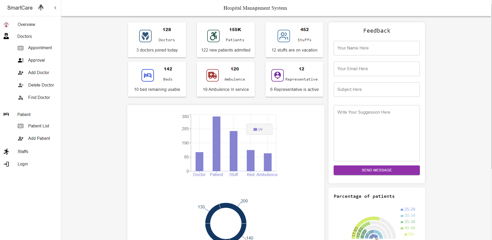

# Hospital Management System (HMS)

This is a MERN (MongoDB, Express.js, React.js, Node.js) web application for efficient hospital management. The goal of this project is to develop a comprehensive and user-friendly system that caters to the needs of hospitals, administrators, doctors, and patients alike. Please note that this project is currently under construction and is continuously being improved and expanded upon.

## Features

- **Role-based User Interface:** The system provides different user interfaces tailored to the specific needs of administrators, doctors, and patients, ensuring a seamless and intuitive experience for each user type.
- **Real-time Updates:** Leveraging the power of React.js and modern web technologies, our web application delivers real-time updates and notifications to keep all stakeholders informed about important events and changes.
- **Graphical Dashboard:** The admin dashboard includes interactive graphs and charts, offering a visual overview of key metrics such as appointments, resource utilization, and financial insights.
- **Appointment Management:** Users can schedule appointments with doctors, and administrators have the ability to approve or decline appointment requests.
- **Doctor Management:** Admins can add new doctors to the system, delete existing doctors, and search for doctors based on specific criteria.
- **Patient Management:** Admins have access to a patient list, and they can assign patients to specific doctors for efficient management.
- **Staff Management (Work in Progress):** A staff section is currently being developed to enable admins to manage the hospital staff effectively.
- **Feedback System:** The system allows patients and staff members to provide feedback, enabling continuous improvement and enhancing the overall user experience.

## Installation

To run this web application locally, follow these steps:

1. Clone the repository: `git clone https://github.com/your-username/hospital-management-system.git`
2. Clone the server repo: `https://github.com/mahi1212/Hospital-Management-Server-Site.git`
3. Live API link: `https://hospital-management-server-site.vercel.app/`
4. Install the dependencies for both the server and client:
   - Server: `cd server && npm install`
   - Client: `cd client && npm install`
5. Configure the environment variables:
   - Create a `.env` file in the `server` directory and define the required variables (e.g., database connection string, API keys, etc.).
6. Start the development server:
   - Server: `cd server && npm start`
   - Client: `cd client && npm start`
7. Open your browser and navigate to `http://localhost:3000` to access the hospital management system.

## Contributing

We welcome contributions from the open source community to make this hospital management system even better. To contribute, please follow these guidelines:

1. Fork the repository and create your branch: `git checkout -b my-feature-branch`.
2. Make your changes and commit them with descriptive commit messages.
3. Push your changes to your forked repository.
4. Submit a pull request, describing the changes you've made and providing any relevant information or screenshots.

## License

This project is licensed under the [MIT License](LICENSE). Create by [Mahi]

## Contact

If you have any questions, suggestions, or feedback, please feel free to reach out to me at `mahi121.mr@gmail.com`. I appreciate your interest in this project!

---

**Keywords**: real-time, reactjs, webapp, mern, hms, hospital-management-system
